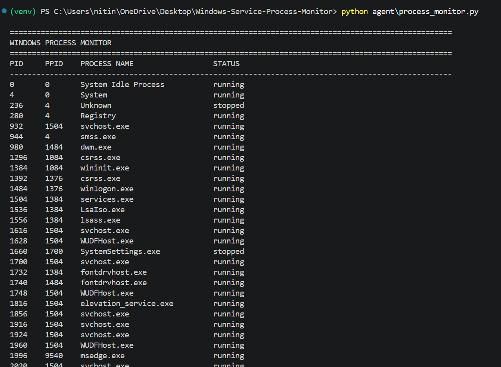
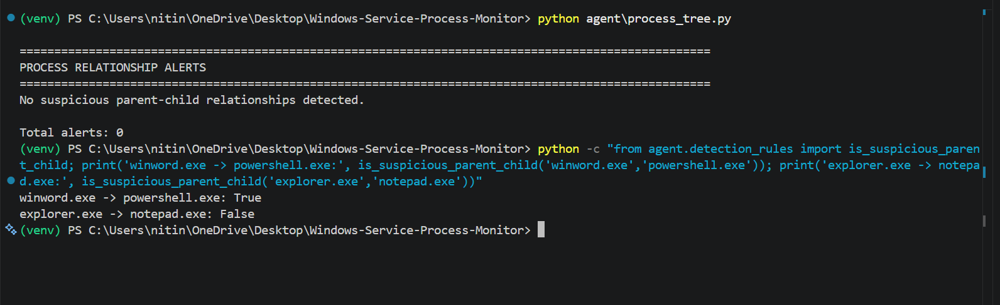
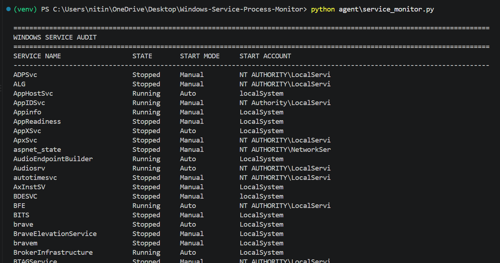
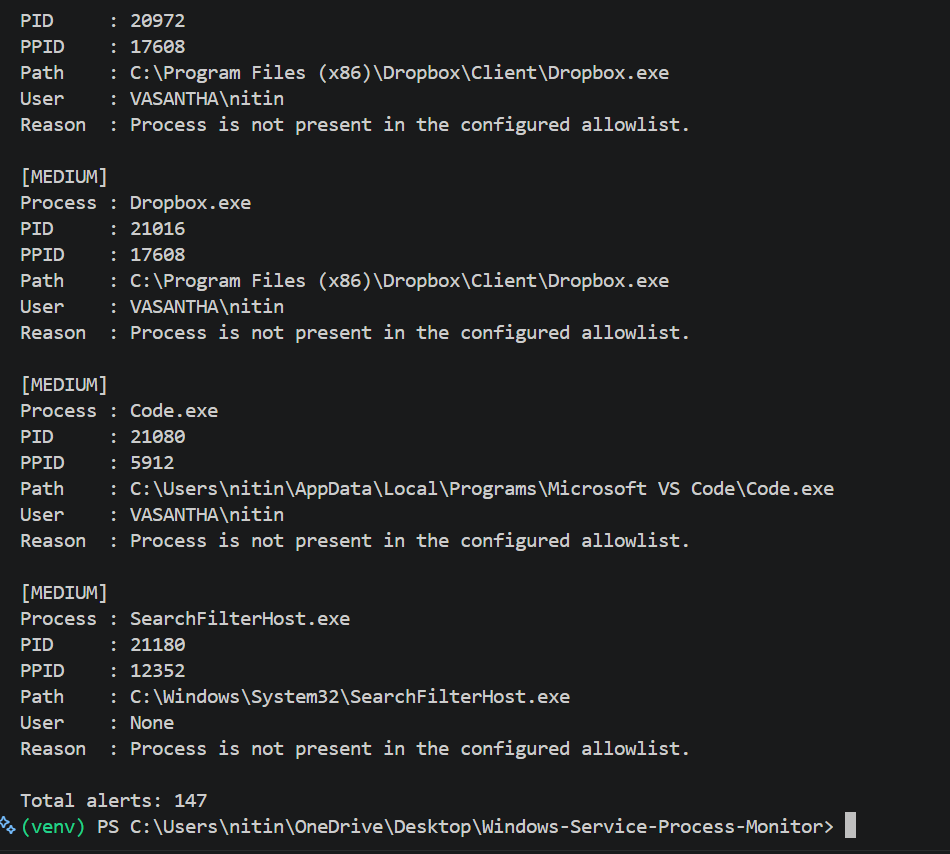
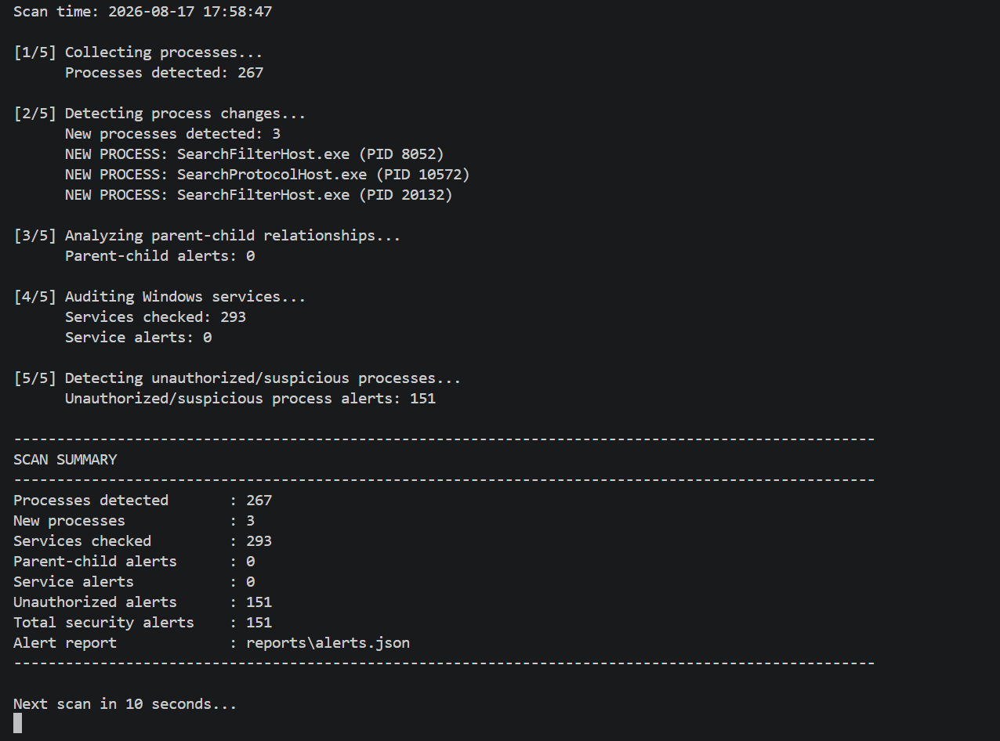
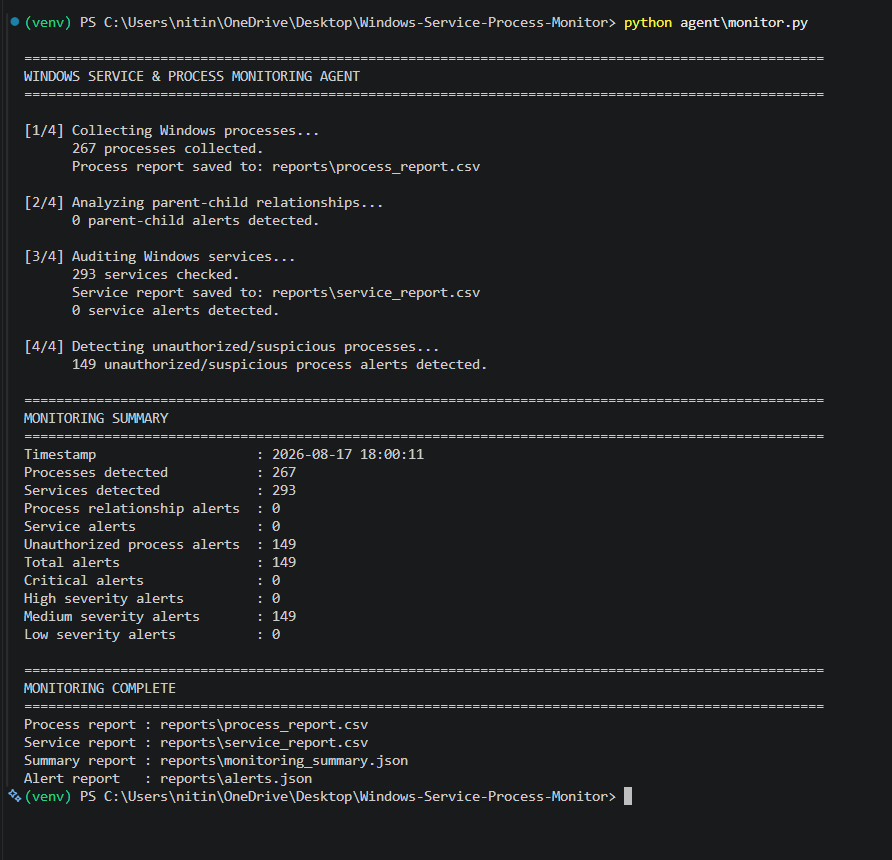
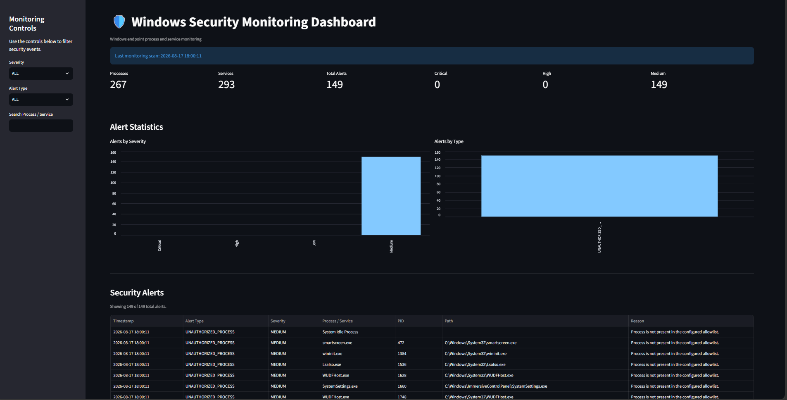

# Windows Service & Process Monitoring Agent

A defensive Windows endpoint monitoring project designed to detect suspicious process behavior, abnormal parent-child relationships, unauthorized processes, and potentially suspicious Windows services.

## Live Deployed Dashboard

The project dashboard is deployed on Streamlit Community Cloud:

https://windows-service-process-monitor.streamlit.app/

[Open the live dashboard](https://windows-service-process-monitor.streamlit.app/)

## Project Overview

The Windows Service & Process Monitoring Agent collects endpoint telemetry from a Windows system and analyzes it using rule-based security detections.

## Objectives

- Monitor active Windows processes.
- Collect PID, PPID, process name, executable path, username, and status.
- Analyze parent-child process relationships.
- Detect potentially suspicious process chains.
- Audit Windows services and executable paths.
- Detect processes running from suspicious user-writable directories.
- Generate severity-based security alerts.
- Generate CSV and JSON reports.
- Display detection results through a Streamlit dashboard.

## Architecture

```text
                    WINDOWS ENDPOINT
                           |
                           v
               +-----------------------+
               |   Monitoring Agent    |
               |      monitor.py       |
               +-----------+-----------+
                           |
            +--------------+--------------+
            |              |              |
            v              v              v
      Process Monitor  Process Tree  Service Monitor
            |              |              |
            v              v              v
      Process Rules  Relationship    Service Rules
                           Rules
            |              |              |
            +--------------+--------------+
                           |
                           v
                   Alert Management
                           |
             +-------------+-------------+
             |                           |
             v                           v
      CSV Reports                  JSON Reports
             |                           |
             +-------------+-------------+
                           |
                           v
                 Streamlit Dashboard
```

## Detection Capabilities

### 1. Process Monitoring

The agent collects:

- PID
- Parent PID
- Process name
- Executable path
- Username
- Process status
- Timestamp

### 2. Parent-Child Detection

The agent checks process relationships for suspicious combinations.

Examples that may require investigation:

```text
winword.exe -> powershell.exe
excel.exe   -> cmd.exe
outlook.exe -> powershell.exe
```

These are detection rules and do not automatically prove malicious activity.

### 3. Unauthorized Process Detection

The project uses a configurable process allowlist. Processes not present in the allowlist can be flagged for investigation.

### 4. Suspicious Path Detection

Processes and services running from potentially user-writable locations can receive additional risk scoring.

Examples:

```text
AppData\Local\Temp
AppData\Roaming
Temp
Users\Public
Downloads
```

### 5. Windows Service Auditing

The service monitor collects:

- Service name
- Display name
- State
- Startup mode
- Start account
- Executable path

## Severity Model

| Severity | Meaning |
|---|---|
| LOW | Low-risk or informational event |
| MEDIUM | Unusual or unauthorized activity requiring investigation |
| HIGH | Multiple suspicious indicators or a higher-risk behavior |
| CRITICAL | Multiple high-confidence suspicious indicators |

## Project Structure

```text
Windows-Service-Process-Monitor/
│
├── agent/
├── dashboard/
├── reports/
├── screenshots/
├── docs/
├── requirements.txt
├── README.md
└── .gitignore
```

## Technologies Used

- Python
- psutil
- pandas
- Streamlit
- PowerShell / Windows Management Instrumentation
- CSV
- JSON
- Git
- GitHub

## Installation

Clone the repository:

```bash
git clone https://github.com/YOUR_USERNAME/Windows-Service-Process-Monitor.git
cd Windows-Service-Process-Monitor
python -m venv venv
venv\Scripts\activate
pip install -r requirements.txt
```

## Running the Monitoring Agent

```bash
python agent\monitor.py
```

## Running Continuous Monitoring

```bash
python agent\continuous_monitor.py
```

Press `CTRL+C` to stop monitoring.

## Running the Dashboard

```bash
streamlit run dashboard\app.py
```

Then open:

```text
http://localhost:8501
```

## Reports

- `reports/process_report.csv` — process telemetry
- `reports/service_report.csv` — Windows service information
- `reports/alerts.json` — consolidated security alerts
- `reports/monitoring_summary.json` — monitoring statistics

## Dashboard Features

- Process count
- Service count
- Total security alerts
- Critical, High, Medium, and Low alerts
- Alerts by severity
- Alerts by type
- Security alert table
- High-priority alert table
- Process inventory
- Windows service inventory
- Process search
- Service search
- Alert filtering

## Project Screenshots

The following screenshots demonstrate the implementation and output of the monitoring agent.

### 1. Process Monitoring



### 2. Parent-Child Process Detection



### 3. Windows Service Audit



### 4. Unauthorized Process Detection



### 5. Continuous Monitoring



### 6. Security Alert Report



### 7. Security Monitoring Dashboard



## Defensive Security Use Case

This project demonstrates endpoint visibility and rule-based detection techniques commonly used in defensive security environments.

It can help analysts investigate:

- Suspicious process execution
- Abnormal process lineage
- Possible persistence mechanisms
- Unauthorized applications
- Suspicious service configurations
- Processes running from unusual locations

## Limitations

This is a learning and defensive monitoring implementation. An alert does not automatically mean that a process or service is malicious.

Production EDR platforms would normally include additional telemetry and analysis such as:

- Digital signature verification
- File hashing
- Windows Event Log analysis
- PowerShell logging
- Network telemetry
- Persistence monitoring
- Threat intelligence enrichment
- Behavioral correlation
- Centralized log collection

## Future Improvements

- Real-time Windows Event Log integration
- Digital signature validation
- SHA-256 file hashing
- YARA-based detection
- Threat intelligence integration
- Email or webhook notifications
- Authentication for the dashboard
- Centralized endpoint monitoring
- Database-backed alert storage
- Advanced behavioral scoring

## Learning Outcomes

- Windows process architecture
- Parent-child process relationships
- Windows service architecture
- Endpoint monitoring
- Rule-based detection
- Security alert generation
- Python automation
- Security reporting
- Streamlit dashboards
- Git and GitHub

## Documentation

Additional documentation is available in the `docs/` directory:

```text
docs/
├── architecture.md
└── flowchart.md
```

## Author

Developed as a cybersecurity internship project.

## Disclaimer

This project is intended for defensive security monitoring, learning, testing, and authorized environments only.
