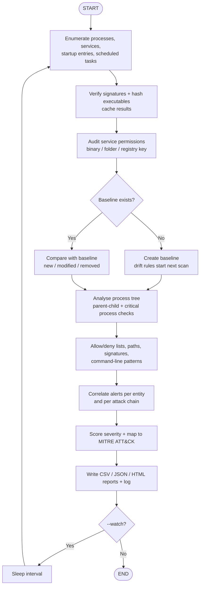
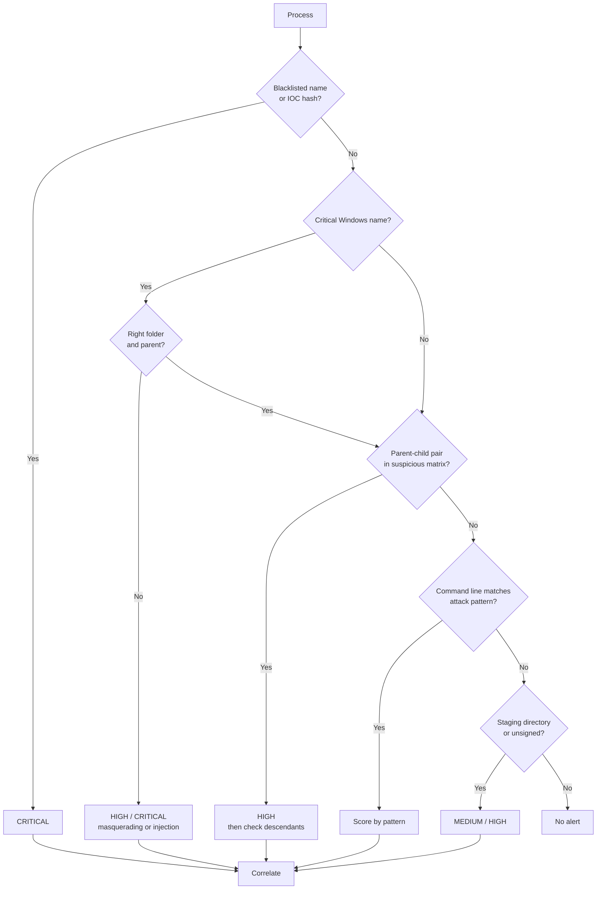

# Flowchart

## Scan workflow

```mermaid
flowchart TD
    A([START]) --> B[Enumerate processes, services,<br/>startup entries, scheduled tasks]
    B --> C[Verify signatures + hash executables<br/>cache results]
    C --> D[Audit service permissions<br/>binary / folder / registry key]
    D --> E{Baseline exists?}
    E -- No --> F[Create baseline<br/>drift rules start next scan]
    E -- Yes --> G[Compare with baseline<br/>new / modified / removed]
    F --> H
    G --> H[Analyse process tree<br/>parent-child + critical process checks]
    H --> I[Allow/deny lists, paths, signatures,<br/>command-line patterns]
    I --> J[Correlate alerts per entity<br/>and per attack chain]
    J --> K[Score severity + map to MITRE ATT&CK]
    K --> L[Write CSV / JSON / HTML reports + log]
    L --> M{--watch?}
    M -- Yes --> N[Sleep interval] --> B
    M -- No --> O([END])
```

## Per-process decision logic

```mermaid
flowchart TD
    P[Process] --> A{Blacklisted name<br/>or IOC hash?}
    A -- Yes --> CR[CRITICAL]
    A -- No --> B{Critical Windows name?}
    B -- Yes --> B1{Right folder<br/>and parent?}
    B1 -- No --> HI[HIGH / CRITICAL<br/>masquerading or injection]
    B1 -- Yes --> C
    B -- No --> C{Parent-child pair<br/>in suspicious matrix?}
    C -- Yes --> HI2[HIGH<br/>then check descendants]
    C -- No --> D{Command line matches<br/>attack pattern?}
    D -- Yes --> HI3[Score by pattern]
    D -- No --> E{Staging directory<br/>or unsigned?}
    E -- Yes --> ME[MEDIUM / HIGH]
    E -- No --> OK[No alert]
    HI --> CORR[Correlate]
    HI2 --> CORR
    HI3 --> CORR
    ME --> CORR
    CR --> CORR
```
